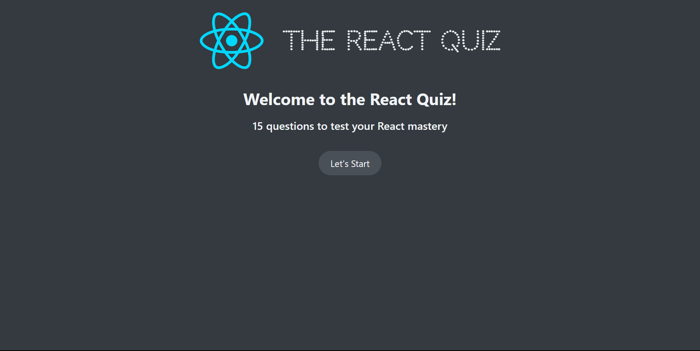

# React Quiz App



## Overview

The **React Quiz App** is a web application designed to test users' knowledge of React. This project is part of Jonas Schmedtmann's Udemy course and focuses on learning and implementing the `useReducer` hook in React.

## Features

- **Interactive Quiz**: Test your React knowledge with multiple-choice questions.
- **Score Tracking**: Keep track of your score as you progress through the quiz.
- **useReducer Hook**: Learn and see an example of the `useReducer` hook in action.
- **JSON Server**: Simulate a backend server for storing quiz questions.

## Technologies Used

- **React**: JavaScript library for building user interfaces.
- **CSS**: Styling the application.
- **JSON Server**: Fake REST API for simulating backend data.

## Demo

View the live demo of the app: [React Quiz App](https://3bdulrahmn69-reactquiz.netlify.app)

**Note**: The App is using a fake REST API to simulate backend data. so the demo may not work as expected.

## Getting Started

### Prerequisites

- Node.js and npm installed on your local machine.

### Installation

1. Clone the repository:
   ```bash
   git clone https://github.com/3bdulrahmn69/react_quiz.git
   ```
2. Navigate to the project directory:
   ```bash
   cd react_quiz
   ```
3. Install dependencies:
   ```bash
   npm install
   ```

### Running the App

1. Start JSON Server:
   ```bash
   npm run server
   ```
2. In another terminal, start the development server:
   ```bash
   npm run dev
   ```
3. Open [http://localhost:5173](http://localhost:5173) in your browser to view the app.

## Usage

1. Open the app in your browser.
2. Click the "Start Quiz" button to begin the quiz.
3. Answer the multiple-choice questions by clicking on the correct answer.
4. Click the "Next" button to move to the next question.
5. After answering all questions, view your final score.

## Learn More

To learn more about React, take a look at the following resources:

- [React Documentation](https://reactjs.org/docs/getting-started.html)
- [React Hooks](https://reactjs.org/docs/hooks-intro.html)

## Authors

- **Abdulrahman Moussa** - [https://www.3bdulrahmn.tech](https://www.3bdulrahmn.tech)
- **Jonas Schmedtmann** - [https://github.com/jonasschmedtmann](https://github.com/jonasschmedtmann)

## Acknowledgements

- **Jonas Schmedtmann** - For the inspiration and guidance in building this project.
- **Vite** - For the fast and modern frontend build tool.
- **React** - For the powerful and flexible frontend library.
- **CSS** - For the styling and design of the application.
- **JSON Server** - For the fake REST API for simulating backend data.
- **Node.js** - For the JavaScript runtime environment.
- **npm** - For the Node Package Manager.
- **Git** - For the distributed version control system.
- **GitHub** - For the hosting and version control platform.
- **VS Code** - For the powerful and customizable code editor.
- **Chrome** - For the fast and modern web browser.
- **Netlify** - For the continuous deployment and hosting platform.

## License

This project is licensed under the MIT License - see the [LICENSE](LICENSE) file for details.
